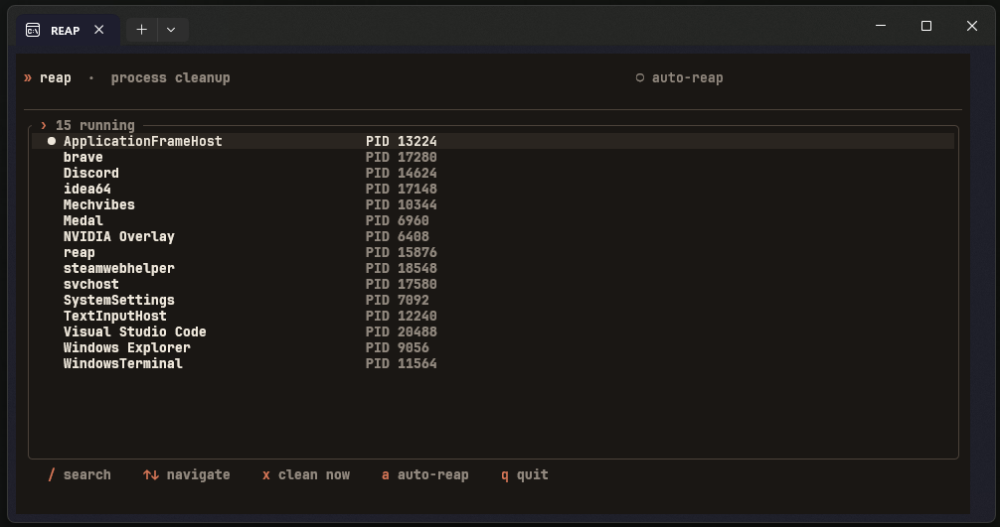

# < reap >

  <i>Reap is a light-weight, closed-source tool designed to make sure that applications actually exit completely.</i>

---

Reap is a light-weight, closed-source tool designed to make sure that applications actually exit completely. On termination of a process, it thoroughly cleans up the entire process tree, covering the child processes, the background workers, and any remaining subprocesses. Because it is fast, has minimal resource requirements, and is reliable, it helps to avoid orphaned processes and maintains a clean system without involving any unnecessary overhead or complexity.

